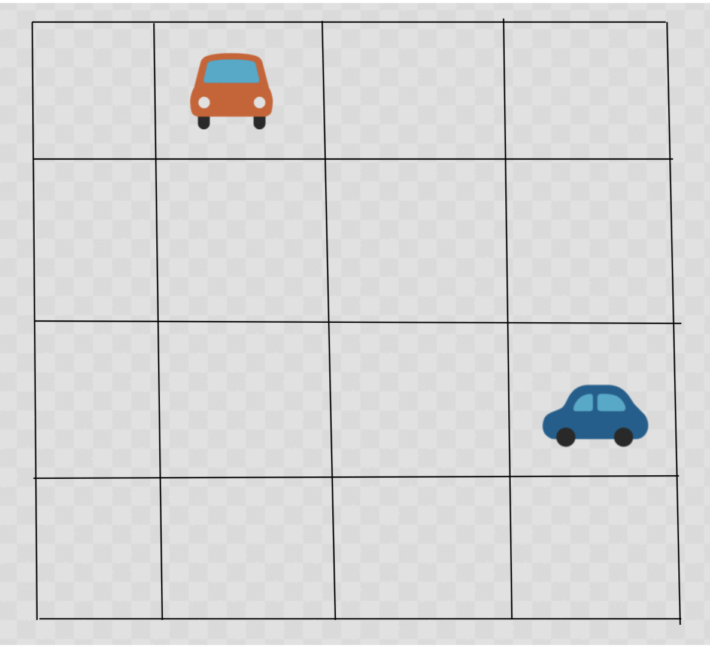
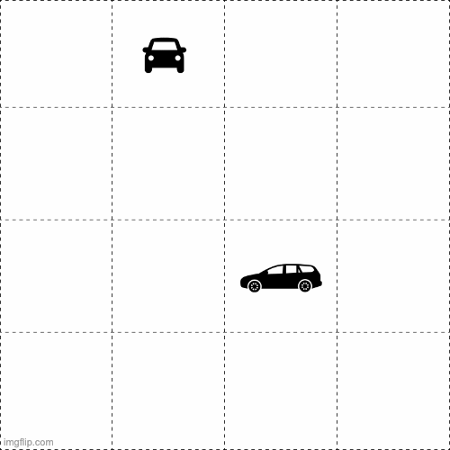
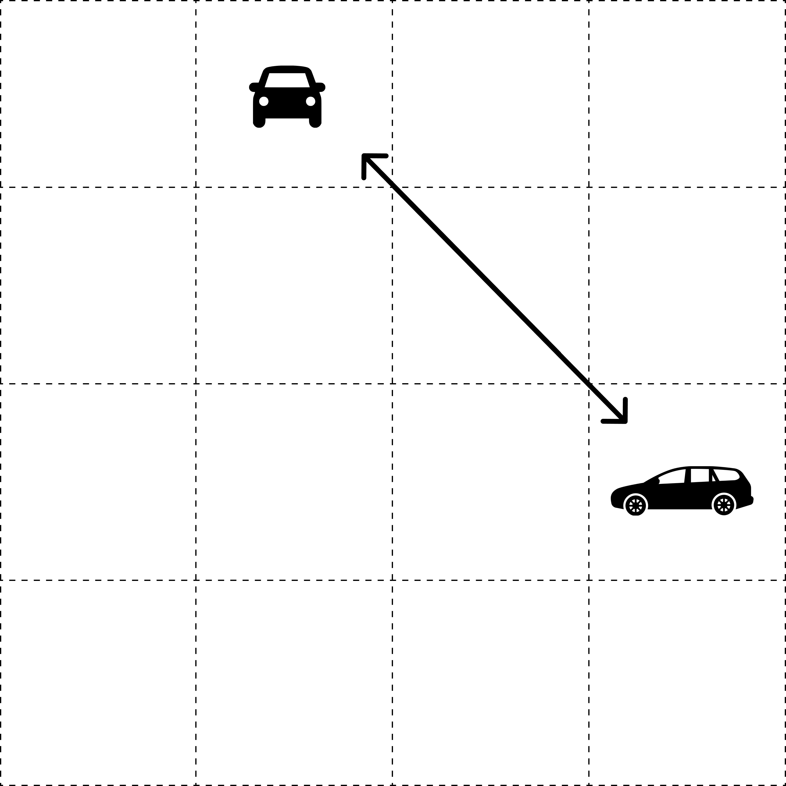

# Self Driving Car: Find all collision courses given a N X M grid/array representing a road full of self driving cars

## Problem

Among the many things a self-driving car must consider when driving, the car has to ensure it <strong>doesn’t collide</strong> with any other cars.

We can represent a road as an N X M grid. How can we tell whether 2 cars are on a collision course with each other?

Take a look at these short animations and see if you notice something.

## Collision

## Safe

## Diagonal
### The key? Cars that are on a collision course are on the same diagonal!

## Usage
<ol>
  <li>Clone the repo</li>
  <li>Open index.html in the browser</li>
  <li>Open the console (right-click -> Inspect/Inspect Element) and see the output</li>
</ol>

## Input
### A 2D array, with 1s and 0s
<ul>
  <li>1 signifies there is a car at the coordinate</li>
  <li>0 signifies the coordinate is empty</li>
</ul>

<pre>
  [0, 1, 1, 1, 0, 0, 1, 1, 0, 0]
  [1, 1, 1, 1, 1, 0, 0, 1, 1, 1]
  [0, 1, 0, 0, 0, 0, 1, 0, 1, 1]
  [0, 1, 0, 1, 1, 0, 0, 1, 0, 0]
  [1, 1, 0, 0, 0, 1, 1, 0, 1, 1]
  [1, 0, 0, 1, 0, 0, 1, 0, 0, 1]
  [1, 1, 0, 1, 1, 1, 0, 1, 0, 1]
  [1, 0, 0, 0, 0, 0, 0, 0, 1, 0]
  [1, 0, 1, 1, 1, 1, 1, 0, 0, 0]
  [1, 0, 0, 0, 1, 1, 1, 1, 0, 1]
</pre>

## Output
### An Object, with key as stringed coordinates, and value as an an array of coordinates which are collision courses
#### Example: The collision courses of (0,0) are coordinates (1,1), (3,3) & (9,9) because (1,1), (3,3) & (9,9) have cars in them
<pre>

  {
    0,0: [[1, 1], [3, 3], [9, 9]],
    0,1: [[1, 2], [3, 4], [4, 5], [5, 6], [6, 7], [7, 8], [1, 0]],
    0,2: [[1, 3], [4, 6], [1, 1]],
    0,3: [[1, 4], [6, 9], [1, 2], [2, 1]],
    .....
  }
</pre>

## Assumptions
### All cars in the same road are moving at the exact same speed. We make this assumption for 2 reasons
<ol>
  <li>They are on the same road space (same speed limits)  </li>
  <li>They are autonomous (can control the exact speed they go)</li>
</ol>

## In data structure terms

Given a 2D array, find all diagonals of all coordinates.

## To add
<ol>
  <li>Unit tests</li>
  <li>More animations</li>
  <li>More complexity</li>
</ol>

### Author

Nikhil Bhaskar
